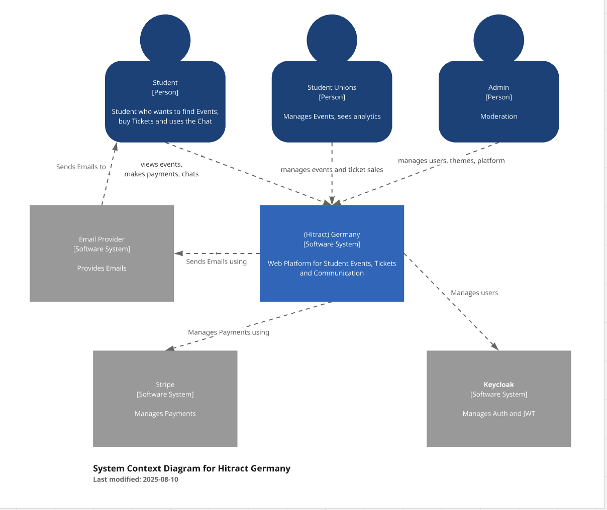

# Project Proposal Template

**Course**: Design of Dynamic Web Systems (M7011E)  
**Team Members**: [Lea Kleinekathöfer, Oskar Franzen, Till Wadehn]  
**Date**: [09.11.2025]  

---

## 1. Problem Statement & Solution

**Problem**: Student associations in Germany currently lack a unified digital platform to manage and promote their events. Tickets are often sold through on-site sales, and advertising must be done separately across various channels. This fragmented approach makes event organization inefficient and limits reach and engagement among students.

**Solution**: A dynamic web application that provides a unified platform for student associations to manage events, sell tickets digitally, and promote activities through a central communication channel. The system streamlines event organization, improves visibility, and enhances the overall student experience.

**Why Dynamic?**: The application adapts its content based on user interactions and real-time data. For example, event recommendations adjust according to user interests and attendance history, while organizers can view live ticket sales and engagement analytics to optimize their marketing and event management strategies.


## 2. Core Features

### **Main Features**

1. **Event Management Dashboard**  
   Allows student organizations to create, edit, and manage events with details such as date, location, ticket types, and capacity.

2. **Digital Ticketing System**  
   Students can purchase tickets securely online and access them digitally via QR code. Each ticket is unique and linked to the buyer’s profile.

3. **Integrated Payment Gateway**  
   Supports common payment methods  and ensures fast, secure transactions for both buyers and organizers.

4. **Event Discovery & Personalized Recommendations**  
   Dynamic feed that shows events based on user interests, previous participation, and campus affiliations.

5. **In-App Chat & Community Interaction**  
   Built-in chat for communication between attendees and organizers — e.g., to coordinate meetups, clarify event details, or handle resale requests.


## 3. Target Users

**Primary Users:**  
- **Students** – use the platform to discover upcoming university events, purchase tickets digitally, and connect with other students via chat to privately resell or transfer tickets if they can no longer attend  
- **Student Organizations / Associations** – create and manage events, handle ticket sales, and communicate with participants
**Key User Journey:**  
A student logs into the app and chooses his city, browses upcoming events, and purchases a ticket through the integrated payment system. If plans change, the student can find a person to resell the ticket thorugh a chat function. Meanwhile, the organizing association tracks ticket sales and communicates with attendees via the integrated chat feature.


## 4. Technology Stack

**Backend**: [Go] with Gin  - Go provides strong concurrency support, fast performance, and is ideal for scalable microservices with lightweight APIs
**Database**: [PostgreSQL] - Reliable relational database with robust ACID compliance and strong support for structured event/ticket data. 
**Frontend**: [Next.Js] Modern component-based UI, and easy integration with REST APIs.

## 5. System Architecture

**Context Diagram**:



**Architecture Overview**:
```
Frontend (Next.js) 
|
API Gateway (REST/WS) 
|
Microservices (Go) <-> PostgreSQL
--> Auth Service (Keycloak/OIDC)
--> Other Services (Stripe, Email Provider, Supabase)

```

**Microservices Plan**:
- **[User Service]**: [Manages user profiles, links to Keycloak identities, resolves roles/permissions, stores tenant (university/city) context.]
- **[Chat Service]**:[Enables real-time communication between students and organizers within event-specific channels or private messages.]
- **[Event Service]**: [CRUD for events, discovery/feed, search/filter, organizer analytics]
- **[Ticket Service]**: [Issues tickets, generates/validates QR codes, handles capacity, transfers/resales, emits ticket.* events.]
- **[Service Template]**: [All services start from the shared Go microservice boilerplate. Clone it per service and run `./scripts/setup-service.sh <module> "<Service Name>" <port>` to stamp out a dedicated repository before adding domain-specific handlers.]


## 6. Requirements Fulfillment (REQ1–REQ27 Summary)

| **Requirement Category** | **Fulfillment Plan** |
|---------------------------|----------------------|
| **Dynamic Behavior (REQ2)** | Personalized event feed and real-time chat updates |
| **Full-Stack Implementation (REQ3–REQ9)** | Next.js frontend, Go backend, PostgreSQL DB, 50%+ backend test coverage |
| **CI/CD & Testing (REQ5–REQ7)** | GitHub Actions pipeline, unit + failure tests, ArgoCD for deployment |
| **Database (REQ8–REQ9)** | Normalized schema: users, events, tickets, messages |
| **Cloud-Native Deployment (REQ10–REQ13)** | Dockerized microservices, Kubernetes (Helm), Prometheus/Grafana monitoring |
| **API Design (REQ14–REQ16)** | RESTful API with OpenAPI (Swagger), message queue for async updates |
| **Architecture & Performance (REQ17–REQ19)** | C4 diagrams, load test script (k6), performance monitoring dashboard |
| **Security & Ethics (REQ20–REQ27)** | Keycloak auth (OAuth2 + JWT), HTTPS with Let’s Encrypt, GDPR documentation, role-based access control, ethical data handling report |

### Advanced Feature Choice

**Chosen Option:**  **Advanced Personalization (White-Label Interface)**

We will extend our application to function as a **white-label platform** for different universities and cities.  
The system dynamically adapts its interface, color scheme, branding, and available events based on the selected university or city at login or registration.

-
## 7. Development Plan
Example of development timeline:
**Weeks 1-2**: Architecture, Database schema, basic services, authentication, Kubernetes setup
**Weeks 3-4**: Core features, API implementation, CI/CD pipeline
**Weeks 5-6**: Advanced feature, comprehensive testing, security
**Weeks 7-8**: Documentation, performance analysis, final polish

## 8. Risk Assessment

**Main Risks**:

- **Technical:**  
  The integration of a secure and reliable payment system may pose challenges related to data protection and transaction errors.  
  *Mitigation:* Use established payment APIs (e.g., PayPal, Stripe) with strong encryption and compliance with GDPR standards to ensure user trust and data security.

- **Scope:**  
   We might spend too much time optimizing small or advanced features while neglecting essential core functionalities.  
  *Mitigation:* Establish clear priorities and ensure that basic components (event listing, ticket purchase, and chat) are fully functional before refining optional features.


**Fallback Plan**: If the full white-label personalization cannot be completed in time, we will first implement a functional single-instance solution for one university to ensure all core requirements (Grade 3) are fully met.

## 9. Team Organization

**[Lea]**: Frontend, Documentation, Test
**[Oskar]**: Backend, Database
**[Till]**: Backend, Database

---

**Approval Request**: We request approval to proceed with this project concept and technology stack.
